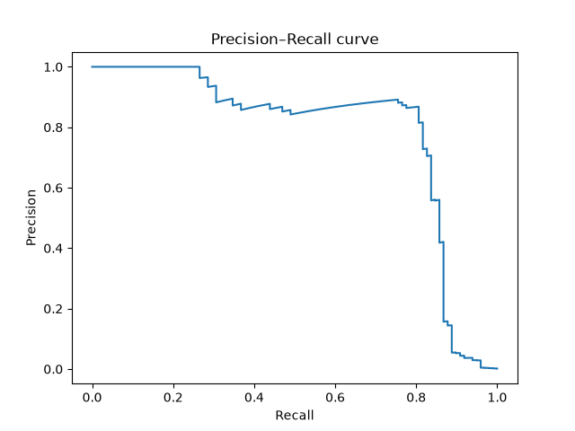
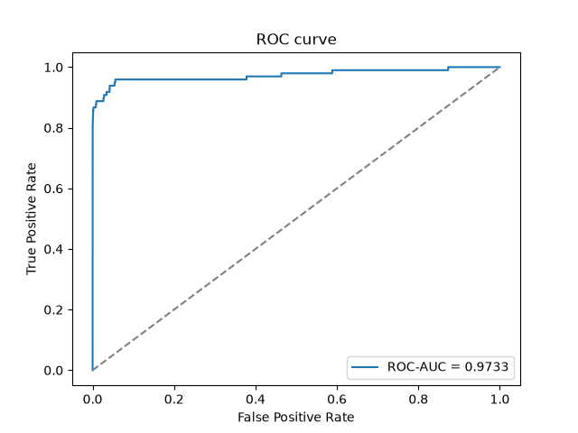
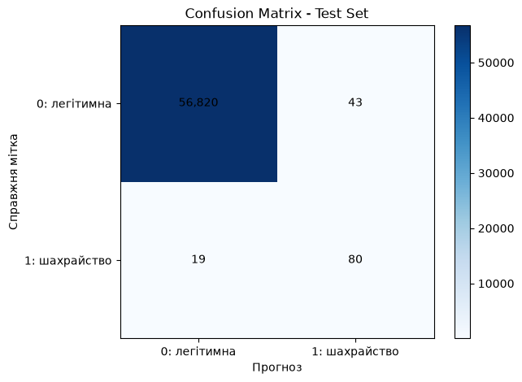

# ЛР2. Поріг рішення за асиметричної вартості помилок

## Мета

Навчити задану нейронну мережу для виявлення шахрайських транзакцій, а потім вибрати поріг класифікації, що мінімізує вартість помилок:

$$C(t)=10\,FN(t)+FP(t).$$

Пропущене шахрайство (FN) коштує в десять разів дорожче за хибну тривогу (FP). Сума транзакції Amount не входить у формулу вартості.

## Дані та запуск

Використано набір [Credit Card Fraud Detection на Kaggle](https://www.kaggle.com/datasets/mlg-ulb/creditcardfraud). Файл **creditcard.csv** потрібно завантажити окремо; він не додається до репозиторію. Для завантаження з Kaggle може знадобитися обліковий запис.

Поклади CSV локально й передай шлях у команді навчання:

~~~bash
uv sync --locked
uv run python lab2_starter.py --data ./creditcard.csv --out results
uv run python lab2_analysis.py
~~~

Перша команда запуску навчає модель один раз і зберігає ваги, прогнози, індекси поділу й параметри стандартизації у теці results/. Друга запускає аналіз зі збережених прогнозів без повторного навчання. Її потрібно виконувати з теки lab2, оскільки шлях до results у скрипті відносний.

У репозиторії мають бути pyproject.toml і uv.lock із зафіксованими версіями залежностей. Не додавайте creditcard.csv.

## Поділ даних

Використано стратифікований поділ 60/20/20 з random_state=0. Перший виклик train_test_split залишає 60% для навчання й 40% для відкладеної частини. Другий ділить відкладені дані порівну: спочатку validation, потім test. Поділ виконано для індексів, тому для аналізу помилок зберігаються номери початкових рядків CSV.

| Частина | Кількість транзакцій | Шахрайства | Частка шахрайств |
|---|---:|---:|---:|
| Train | 170 884 | 295 | 0,1726% |
| Validation | 56 961 | 98 | 0,1720% |
| Test | 56 962 | 99 | 0,1738% |
| **Усього** | **284 807** | **492** | **0,1727%** |

Стандартизатор StandardScaler навчено лише на train. Якщо обчислювати середні та стандартні відхилення за всім набором до поділу, статистики міститимуть інформацію з validation і test. Це витік даних і може зробити оцінку якості нереалістичною. До validation і test застосовано ті самі статистики, що були обчислені на train.

## Модель і метрики

Використано модель Linear(29, 32) → ReLU → Linear(32, 1), BCEWithLogitsLoss без зважування класів та оптимізатор Adam із швидкістю навчання 0,001. Модель навчалася 12 епох на CPU у float32; використано ваги останньої епохи.

Модель повертає оцінку s після sigmoid. Для порога t прогноз шахрайства робиться за правилом s ≥ t. Лічильники визначаються так:

- TP — шахрайство правильно позначене як шахрайство;
- FP — легітимна транзакція помилково позначена як шахрайство;
- FN — шахрайство пропущене;
- TN — легітимна транзакція правильно позначена як легітимна.

Матриця плутанини записана в порядку рядків «справжня мітка» і стовпців «прогноз»:

|  | Прогноз 0 | Прогноз 1 |
|---|---:|---:|
| Справжня мітка 0 | TN | FP |
| Справжня мітка 1 | FN | TP |

Для validation побудовано PR- і ROC-криві. ROC-AUC становить **0,9733**. Висока ROC-AUC показує, що модель загалом добре впорядковує приклади за оцінкою, але не визначає вартість для конкретного порога. За дуже рідкісного позитивного класу навіть мала частка хибних тривог може означати багато FP, а precision безпосередньо залежить від FP.

## Пошук порога на validation

Кандидати — усі унікальні validation-оцінки та +∞. Для +∞ усі прогнози негативні. Оцінки сортуються за спаданням, а однакові оцінки обробляються однією групою. Після додавання кожної групи накопичуються TP і FP; далі FN = кількість позитивних − TP, TN = кількість негативних − FP. Так пороги перевіряються після одного сортування, за O(n log n), без повторного проходу по всій validation-вибірці для кожного порога. Якщо кілька порогів мають однакову мінімальну вартість, обирається найбільший.

Повна таблиця всіх 55 970 унікальних оцінок і +∞ збережена у [fast_candidates_validation.csv](fast_candidates_validation.csv). Нижче наведено лише підсумкове порівняння.

| Правило на validation | Поріг | TP | FP | FN | TN | C |
|---|---:|---:|---:|---:|---:|---:|
| Стандартний поріг | 0,5 | 71 | 9 | 27 | 56 854 | 279 |
| Мінімум вартості | **0,031193915754556656** | **82** | **34** | **16** | **56 829** | **194** |
| Усі негативні | +∞ | 0 | 0 | 98 | 56 863 | 980 |

За обраного t* validation-вартість зменшилася з 279 до 194. Модель виявила на 11 шахрайств більше (TP: 71 → 82), але кількість хибних тривог зросла на 25 (FP: 9 → 34); кількість пропущених шахрайств зменшилася на 11 (FN: 27 → 16). Через десятикратну вагу FN сумарна вартість на validation стала нижчою на 85.

## Незалежна перевірка пошуку порога

Для наборів A, B і C швидкий пошук порівняно з окремим прямим перебором за правилом s ≥ t для кожного кандидата. Усі лічильники та вартості збігаються.

### Набір A

Оцінки: [0,9; 0,7; 0,7; 0,4; 0,2; 0,1]  
Мітки: [0; 1; 0; 1; 0; 0]

| Поріг | TP | FP | FN | TN | C |
|---:|---:|---:|---:|---:|---:|
| +∞ | 0 | 0 | 2 | 4 | 20 |
| 0,9 | 0 | 1 | 2 | 3 | 21 |
| 0,7 | 1 | 2 | 1 | 2 | 12 |
| 0,4 | 2 | 2 | 0 | 2 | 2 |
| 0,2 | 2 | 3 | 0 | 1 | 3 |
| 0,1 | 2 | 4 | 0 | 0 | 4 |

Вибраний поріг: **0,4**. Однакові оцінки 0,7 мають різні справжні мітки, тому перевірка підтверджує, що їх треба включати до прогнозу одночасно.

### Набір B

Оцінки: [0,9; 0,6; 0,3]  
Мітки: [0; 0; 0]

| Поріг | TP | FP | FN | TN | C |
|---:|---:|---:|---:|---:|---:|
| +∞ | 0 | 0 | 0 | 3 | 0 |
| 0,9 | 0 | 1 | 0 | 2 | 1 |
| 0,6 | 0 | 2 | 0 | 1 | 2 |
| 0,3 | 0 | 3 | 0 | 0 | 3 |

Вибраний поріг: **+∞**. У наборі немає позитивних міток, тому прогноз «усі негативні» має нульову вартість.

### Набір C

Оцінки: [0,8; 0,5 × 11; 0,2]. Серед одинадцяти оцінок 0,5 перша має мітку 1, решта десять — мітку 0. Повні мітки: [1; 1; 0 × 11].

| Поріг | TP | FP | FN | TN | C |
|---:|---:|---:|---:|---:|---:|
| +∞ | 0 | 0 | 2 | 11 | 20 |
| 0,8 | 1 | 0 | 1 | 11 | 10 |
| 0,5 | 2 | 10 | 0 | 1 | 10 |
| 0,2 | 2 | 11 | 0 | 0 | 11 |

Однакова мінімальна вартість 10 досягається при 0,8 і 0,5. За правилом нічиєї обрано більший поріг: **0,8**.

## Оцінка на test

Після вибору t* на validation його зафіксовано й застосовано до test. Test не використовувався для підбору порога чи параметрів моделі.

|  | Прогноз 0 | Прогноз 1 |
|---|---:|---:|
| Справжня мітка 0 | TN = 56 820 | FP = 43 |
| Справжня мітка 1 | FN = 19 | TP = 80 |

- Вартість: C = 10 × 19 + 43 = 233.
- Precision: 80 / (80 + 43) = 0,6504.
- Recall: 80 / (80 + 19) = 0,8081.

Якщо TP + FP = 0, precision не визначений, оскільки немає позитивних прогнозів. Якщо TP + FN = 0, recall не визначений, оскільки у вибірці немає справжніх позитивних прикладів.

## Перші помилки на test за номером рядка CSV

Таблиці містять перші п’ять FP і FN, відсортовані за номером початкового рядка CSV. Відстань — це |s − t*|.

| Рядок CSV | Тип | Мітка | Оцінка s | Amount | Відстань до t* |
|---:|---|---:|---:|---:|---:|
| 460 | FP | 0 | 0,196159 | 2,00 | 0,164965 |
| 2 961 | FP | 0 | 0,080961 | 2,49 | 0,049767 |
| 10 783 | FP | 0 | 0,966327 | 89,99 | 0,935133 |
| 13 405 | FP | 0 | 0,932032 | 89,99 | 0,900838 |
| 13 617 | FP | 0 | 0,922762 | 89,99 | 0,891568 |
| 10 497 | FN | 1 | 0,011464 | 3,79 | 0,019730 |
| 52 521 | FN | 1 | 0,006373 | 105,99 | 0,024821 |
| 55 401 | FN | 1 | 0,005642 | 1,00 | 0,025553 |
| 91 671 | FN | 1 | 0,000500 | 290,18 | 0,030693 |
| 93 486 | FN | 1 | 0,018352 | 0,00 | 0,012843 |

Серед наведених FP є як транзакції з малим Amount, так і транзакції з Amount 89,99. Суми серед наведених FN також різняться. Це показує, що за десятьма прикладами не видно простого зв’язку між Amount і помилкою. За такою малою кількістю прикладів не можна встановити причину помилок або внесок окремої ознаки: модель використовує також V1–V28.

Наведені FP мають оцінки вище порога, а FN — нижче. Відстань показує, наскільки далеко оцінка розташована від порога, але сама по собі не пояснює, чому модель помилилася.

## Висновок

Підбір порога змінив лише правило перетворення оцінок незмінної моделі на класи. На validation нижчий поріг зменшив кількість пропущених шахрайств на 11 ціною 25 додаткових хибних тривог і знизив вартість з 279 до 194. На test за цим зафіксованим порогом отримано 80 TP, 43 FP, 19 FN і вартість 233. Виграш на validation не гарантує такого самого результату на test: це різні вибірки, а поріг вибирався за конкретними оцінками validation.

## Файли результатів

- results/model.pt, results/predictions.npz, results/preprocessing.npz, results/run.json — ваги, прогнози, індекси та параметри підготовки даних;
- results/pr_curve.png, results/roc_curve.png — криві на validation;
- fast_candidates_validation.csv — повна таблиця кандидатів validation;
- test_errors.csv — збережені test-рядки з типом результату та Amount;
- confusion_matrix_test.png — heatmap матриці плутанини test.

## Використані джерела та допомога

- Набір даних: [Kaggle — Credit Card Fraud Detection](https://www.kaggle.com/datasets/mlg-ulb/creditcardfraud).
- Стартовий код навчання надано.
- ChatGPT використовувався для пояснення алгоритму пошуку порога, перевірки коду та структурування README;

